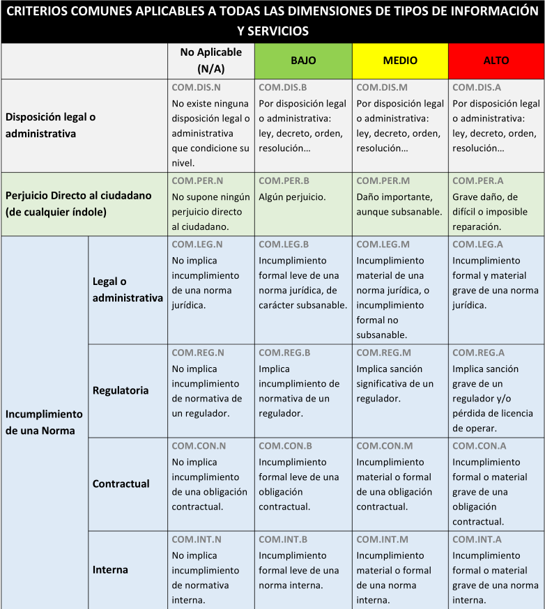

## CRITERIOS DE VALORACIÓN <!-- {docsify-ignore} -->

> [!INFO|style:callout|label:Contenido Literal]
> Contenido literal extraído de la Guía CCN-STIC 803. ENS. Valoración de los sistemas.

Habitualmente, se procede a la valoración individualizada de los distintos tipos de información y servicios en el ámbito de aplicación, considerando las dimensiones relevantes para cada uno de ellos.

Sin embargo, la valoración individual de cada información manejada y cada servicio prestado puede no ser la forma más efectiva de trabajar y puede dar lugar a escenarios más heterogéneos de lo necesario, tanto dentro de una misma entidad, como en sistemas de intercambio de información o prestación de servicios. Por ello se recomienda en primer lugar proceder a la valoración de los activos esenciales que sin duda van a exigir las valoraciones más restrictivas en las dimensiones de seguridad y que determinarán con ello la categoría del sistema.

Esta guía incluye criterios que pueden resultar de aplicación a una o varias dimensiones, tanto de tipos de información como de servicios.

Cada criterio de valoración es codificado para facilitar su referencia cuando se justifiquen las decisiones de valoración.

### CRITERIOS COMUNES APLICABLES A TODAS LAS DIMENSIONES :id=criterios-comunes <!-- {docsify-ignore} -->

Se establecen criterios que son de aplicación a todas las dimensiones de seguridad (seleccionando un nivel BAJO, MEDIO o ALTO, de acuerdo al ENS), tanto de tipos de información como de servicios, considerando las consecuencias de un impacto negativo sobre la seguridad de la información y de los servicios, atendiendo, conforme al Anexo I del Real Decreto 311/2022, a su repercusión en la capacidad de la organización para alcanzar sus objetivos, la protección de los activos a su cargo y garantizar la conformidad con el ordenamiento jurídico.

Los criterios de impacto considerados son los siguientes:

**Disposición legal**: Existencia de una disposición legal o administrativa que condicione el nivel de la dimensión.

**Perjuicio directo**: Existencia de un perjuicio directo para el ciudadano, entendido como persona física, jurídica o profesional, y de cualquier índole.

**Incumplimiento de una norma**: Implica el incumplimiento de una norma (legal o administrativa, regulatoria, contractual o interna).

**Pérdidas económicas**: Implica pérdidas económicas para la entidad.

**Reputación**: Implica daño reputacional para la entidad.

**Protestas**: Previsión de que pueda desembocar en protestas.

**Delitos**: Facilitaría la comisión de delitos o dificultaría su investigación.

### RTO (TIEMPO DE RECUPERACIÓN OBJETIVO) :id=rto <!-- {docsify-ignore} -->

| RTO             | < 4 horas | 4 horas - 1 día | 1 día – 5 días | > 5 días    |
|-----------------|------------|----------------|----------------|-------------|
| **Nivel**       | **Alto**   | **Medio**      | **Bajo**       | **No Aplicable** |

Tabla 2. Plazos para la determinación de la disponibilidad de los servicios  

4h = 4 horas  
1d = 1 día = 24 horas  
5d = 5 días (1 semana laboral)  

